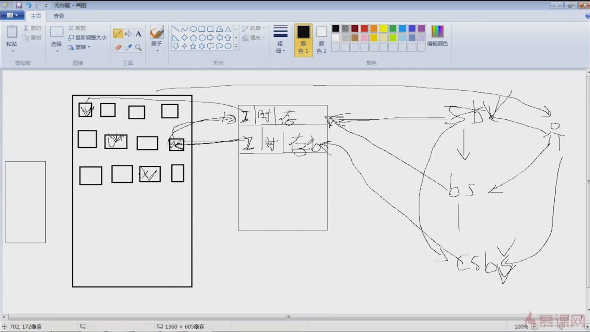
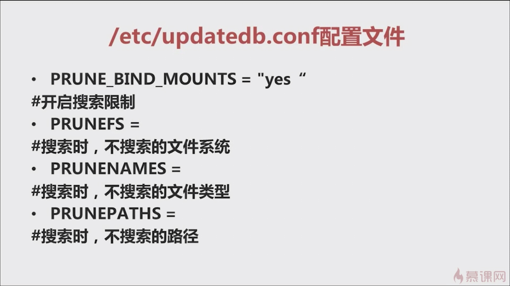

[鸟哥的linux私房菜](http://cn.linux.vbird.org/linux_basic/0105computers_1.php)

# 什么是计算机
计算机其实是接受使用者输入指令与数据，经由中央处理器的数学与逻辑单元运算处理后，以产生或储存成有用的信息。 因此，只要有输入设备 (不管是键盘还是触控式萤幕)及输出设备(萤幕或直接打印出来)，让你可以输入数据使该机器产生信息的， 那就是一部计算机了。

# 计算机硬件的五大单元
+ 输入单元：包括键盘、鼠標、读卡机、扫描器、手写板、触控萤幕等等一堆；
+ 主机部分：这个就是系统单元，被主机机壳保护住了，里面含有 CPU 与主内存等；
    * 存储单元
    * CPU内部的控制单元
    * 算数逻辑单元
+ 输出单元：例如萤幕、打印机等等


# cpu种类
+ 精简指令集(Reduced Instruction Set Computer, RISC)
+ 复杂指令集(Complex Instruction Set Computer, CISC)

# 计算机分类
+ 超级计算机(Supercomputer)
+ 大型计算机(Mainframe Computer)
+ 迷你计算机(Minicomputer)
+ 工作站(Workstation)
+ 微计算机(Microcomputer)

# 计算机上面常用的计算单位 (容量、速度等)
+ 容量单位
<table>
    <thead>
        <tr>
            <td>进位制</td>
            <td>K</td>
            <td>M</td>
            <td>G</td>
            <td>T</td>
            <td>P</td>
        </tr>
    </thead>
    <tbody>
        <tr>
            <td>二进位</td>
            <td>1024</td>
            <td>1024K</td>
            <td>1024M</td>
            <td>1024G</td>
            <td>1024T</td>
        </tr>
        <tr>
            <td>十进位</td>
            <td>1000</td>
            <td>1000K</td>
            <td>1000M</td>
            <td>1000G</td>
            <td>1000T</td>
        </tr>
    </tbody>
</table>

+ 速度单位

CPU的运算速度常使用 MHz 或者是 GHz 之类的单位，这个 Hz 其实就是秒分之一(Hz频率的单位与时间倒数)。而在网络传输方面，由於网络使用的是 bit 为单位，因此网络常使用的单位为 Mbps 是 Mbits per second，亦即是每秒多少 Mbit。举例来说，大家常听到的 8M/1M ADSL 传输速度，如果转成档案容量的 byte 时，其实理论最大传输值为：每秒 1Mbyte/ 每秒125Kbyte的上传/下载容量！

# 个人计算机架构与周边设备
(Intel)芯片组通常又分为两个桥接器来控制各组件的沟通， 
+ 北桥：负责连结速度较快的CPU、主内存与显示卡等组件；
+ 南桥：负责连接速度较慢的周边介面， 包括硬盘、USB、网络卡等等。


AMD为了加速这两者的沟通，所以将内存控制组件整合到CPU当中  

主要的组件为：CPU、主内存、磁盘设备(IDE/SATA)、系统总线芯片组(南桥/北桥)、显示卡介面(PCI-Express)与其他介面卡(PCI)。

# CPU
 频率就是CPU每秒钟可以进行的工作次数  

# CPU的『外频』与『倍频』
所谓的外频指的是CPU与外部组件进行数据传输时的速度，倍频则是 CPU 内部用来加速工作效能的一个倍数， 两者相乘才是CPU的频率速度。

# 32位与64位
一般主机板芯片组有分北桥与南桥， 北桥的系统总线称为系统系统总线，因为是内存传输的主要通道，所以速度较快。 南桥就是所谓的输入输出(I/O)系统总线，主要在联系硬盘、USB、网络卡等周边设备。

北桥所支持的频率我们称为前端系统总线速度(Front Side Bus, FSB)， 而每次传送的位数则是系统总线宽度

# 内存
ROM(只读存储器) RAM(随机存储器)

# 数据表示方式
如果以十进位来说，3456的意义为：
3456 = 3*10^3 + 4*10^2 + 5*10^1 + 6*10^0

1101010的数值转为十进位的话，结果如下：
1101010=1*2^6 + 1*2^5 + 0*2^4 + 1*2^3 + 0*2^2 + 1*2^1 + 0*2^0
= 64 + 32 + 0*16 + 8 + 0*4 + 2 + 0*1 = 106

使用十进位的106转成二进位

最后的写法就如同上面的红色箭头，由最后的数字向上写，因此可得到1101010的数字

八进制化为二进制：
（17.36）8 = （001 111 .011 110）2 = （1111.01111）2

八进制化为十进制：
[](../iamges/8jinzhi.jpg)

十进制化八进制
将十进制数115转化为八进制数
8| 115…… 3
8| 14 …… 6
8| 1 …… 1
结果：（115）10 = （163）8

# 软件程序运作
计算机系统将软件分为两大类，一个是系统软件，一个是应用程序

# 重点回顾
+ 计算机的定义为：『接受使用者输入指令与数据，经由中央处理器的数学与逻辑单元运算处理后，以产生或储存成有用的信息』；

+ 计算机的五大单元包括：输入单元、 输出单元、CPU内部的控制单元、算数逻辑单元与主内存五大部分；

+ 数据会流进/流出内存是CPU所发布的控制命令，而CPU实际要处理的数据则完全来自於主内存；

+ CPU依设计理念主要分为：精简指令集(RISC)与复杂指令集(CISC)系统；

+ 关於CPU的频率部分：外频指的是CPU与外部组件进行数据传输时的速度，倍频则是CPU内部用来加速工作效能的一个倍数， 两者相乘才是CPU的频率速度；

+ 一般主机板芯片组有分北桥与南桥，北桥的系统总线称为系统系统总线，因为是内存传输的主要通道，所以速度较快。 南桥就是所谓的输入输出(I/O)系统总线，主要在联系硬盘、USB、网络卡等周边设备；

+ 北桥所支持的频率我们称为前端系统总线速度(Front Side Bus, FSB)，而每次传送的位数则是系统总线宽度。

+ CPU每次能够处理的数据量称为字长大小(word size)，字长大小依据CPU的设计而有32位与64位。 我们现在所称的计算机是32或64位主要是依据这个 CPU解析的字长大小而来的！

+ 个人计算机的主内存主要组件为动态随机访问内存(Dynamic Random Access Memory, DRAM)， 至於CPU内部的第二层缓存则使用静态随机访问内存(Static Random Access Memory, SRAM)；

+ BIOS(Basic Input Output System)是一套程序，这套程序是写死到主机板上面的一个内存芯片中， 这个内存芯片在没有通电时也能够将数据记录下来，那就是只读内存(Read Only Memory, ROM)；

+ 显示卡的规格有PCI/AGP/PCIe，目前的主流为PCIe介面；

+ 硬盘的组成为：圆形磁碟盘、机械手臂、 磁碟读取头与主轴马达所组成的，其中磁碟盘的组成为磁区、磁轨与磁柱；

+ 操作系统(Operating System, OS)其实也是一组程序， 这组程序的重点在於管理计算机的所有活动以及驱动系统中的所有硬件。

+ 计算机主要以二进位作为单位，常用的磁碟容量单位为bytes，其单位换算为1 Byte = 8bits。

+ 最阳春的操作系统仅在驱动与管理硬件，而要使用硬件时，就得需要透过应用软件或者是壳程序(shell)的功能， 来呼叫操作系统操纵硬件工作。目前称为操作系统的，除了上述功能外，通常已经包含了日常工作所需要的应用软件在内了。

# 磁盘分区
## 分区类型
+ 主分区:最多只有4个。
+ 扩展分区:
    + 最多只能有1个
    + 主分区加扩展分区最多只有4个
    + 不能写入数据，只能包含逻辑分区
+ 逻辑分区

## 格式化
格式化（高级格式化）又称逻辑格式化，它是指根据用户选定的文件系统(如FAT16,FAT32,ATFS,EXT2,EXT3,EXT4等)，在磁盘的特定区域写入特定数据，在分区中划出一片用于存放文件分配表，目录表等用于文件管理侧磁盘空间

# 硬件设备文件名
<table>
    <thead>
        <tr>
            <td>硬件</td>
            <td>设备文件名</td>
        </tr>
    </thead>
    <tbody>
        <tr>
            <td>IDE硬盘</td>
            <td>/dev/hd[a-d]</td>
        </tr>
        <tr>
            <td>SCSI/SATA/USB硬盘</td>
            <td>/dev/sd[a-p]</td>
        </tr>
        <tr>
            <td>光驱</td>
            <td>/dev/cdrom或/dev/hdc</td>
        </tr>
        <tr>
            <td>打印机(25针)</td>
            <td>/dev/fd[0-1]</td>
        </tr>
        <tr>
            <td>打印机(USB)</td>
            <td>/dev/lp[0-1]</td>
        </tr>
        <tr>
            <td>鼠标</td>
            <td>/dev/mouse</td>
        </tr>
    </tbody>
</table>

# 设备文件名
+ /dev/hda1(IDE硬盘接口) a第一块硬盘 1代表第一个分区
+ /dev/sda1(SCSI硬盘接口，SATA硬盘接口)

# 挂载
+ 必须分区
    + /(根分区)
    + swap分区(交换分区，内存2倍，不超过2GB)
+ 推荐分区
    + /boot(启动分区，200MB)
    
# 命令的基本格式
`[root@localhost ~]# `  
其中
+ root:当前登录用户
+ localhost:主机名
+ ~:当前所在目录(家目录/root,普通用户/home/user1)
+ \#:超级用户的提示符(普通用户的提示符是$)

`命令 [选项] [参数]`  
+ 个别命令使用不遵循此格式
+ 当有多个选项时，可以写在一起
+ 简化选项与完整选项`-a`等于`--all`

## ls
`ls [选项] [文件或目录]`  
选项：
+ -a:显示所有文件，包括隐藏文件
+ -l:显示详细信息
+ -d:查看目录属性
+ -h:人性化显示文件大小
+ -i:显示inode

`ls -l`与`ll`作用一样

```
[root@localhost ~]# ls -l
总用量 4
-rw-------. 1 root root 1254 7月  24 14:55 anaconda-ks.cfg
[root@localhost ~]# 
```

`-rw-------. 1 root root 1254 7月  24 14:55 anaconda-ks.cfg
`  
+ -rw-r--r--
    + -文件类型(-文件 d目录 lls软链接文件)
    + rw-(所有者)
    + ---(g所属组)
    + ---(o其他人)
    + r读 w写 x执行
    + .(ACL权限)
    + 1(引用次数)
    + root(所有者)
    + root(所属组)
    + 1254(文件大小)加`-h参数文件大小可以人性化显示单位`

```
[root@localhost ~]# ls -lh
总用量 4.0K
-rw-------. 1 root root 1.3K 7月  24 14:55 anaconda-ks.cfg
[root@localhost ~]# 
```
# 文件处理命令

## 创建目录
`mkdir -p [目录名]`  
+ -p:递归创建

## 切换目录
`cd [目录]`  

### 简化操作
+ `cd ~`:进入当前用户的家目录
+ `cd`:进入当前用户的家目录
+ `cd -`:进入上次目录
+ `cd ..`:进去上一级目录
+ `cd .`:进入当前目录


## 查询目录所在位置
`pwd`


## 删除空目录
`rmdir [目录名]`


## 删除文件或目录
`rm -rf [文件或目录]`  
选项
+ `-r`:删除目录
+ `-f`:强制


## 复制命令:cp
`cp [选项] [原文件或目录] [目标目录]`  
选项：
+ `-r`:复制目录
+ `-p`:连带文件属性复制
+ `-d`:若源文件是链接文件,则复制链接属性
+ `-a`:相当于`-pdr

`
## 剪切或改名命令:mv
`mv [原文件或目录] [目标目录]`

## 常见目录作用
+ `/`:根目录
+ `/bin`:命令保存目录(普通用户就可以读取的命令)
+ `/boot`:启动目录,启动相关文件
+ `/dev`:设备文件保存目录
+ `/etc`：配置文件保存目录
+ `/home`:普通用户的家目录
+ `/lib`:系统库保存目录
+ `/mnt`：系统挂载目录
+ `/media`:挂载目录
+ `/root`:超级用户的家目录
+ `/tmp`:临时目录
+ `/sbin`:命令保存目录(超级用户才能使用的目录)
+ `/proc`:直接写入内存
+ `/sys`:
+ `/usr`:系统软件资源目录
    + `/usr/bin`:系统命令(普通用户)
    + `/usr/sbin`:系统命令(超级用户)
+ `/var`:系统相关文档内容

## 链接命令:ln
`ln -s [原文件] [目标文件]`
选项:  
`-s`:创建软链接  
硬链接特征:  
+ 拥有相同的i节点和存储block块，可以看做是同一个文件
+ 可通过i节点识别
+ 不能跨分区
+ 不能针对目录使用

软链接特征：
+ 类似windows快捷方式
+ 软链接拥有自己的I节点和block块，但是数据中只保存原文件的文件名和I节点号，并没有实际的文件数据
+ lrwxrwxrwx l 软链接 软链接的文件权限都为rwxrwxrwx
+ 修改任意文件，另一个都改变
+ 删除原文件，软链接不能使用


  
## 文件搜索
### locate命令
+ `locate 文件名`:在后台数据库中按文件名搜索，搜索速度更快
+ `/var/lib/mlocate`:locate命令所搜索的后台数据库(更新频率一天一次)
+ `uodatedb`:更新数据库
修改配置文件`/etc/updatedb.conf`


## 搜索命令的命令whereis与which
`whereis 命令名`  只能搜索系统命令  

搜索命令所在路径及帮助文档所在位置
选项:
+ `-b`:只查找可执行文件
+ `-m`:只查找帮助文件

`which 命令名`  
搜索命令所在路径及别名

### PATH环境变量
定义的是系统搜索命令的路径

### find命令
`find [搜索范围] [搜索条件]`  
`find / -name install.log`
find是在系统当中搜索符合条件的文件名。如果需要匹配，使用通配符，通配符是完全匹配  

linux中的通配符
+ `*`:匹配任意内容
+ `?`:匹配任意一个字符
+ `[]`:匹配任意一个中括号内的字符  

`find /root -iname install.log` 不区分大小写  
`find /root -user root` 按照所有者搜索  
`find /root -nouser` 查找没有所有者的文件  

`find /var/log/ -mtime +10` 查找10天前修改的文件
`-10`:10天内修改的文件
`10`:10天当前的修改的文件
`+10`:10天前修改的文件

`atime`:文件访问时间
`ctime`:改变文件属性
`mtime`:修改文件内容

`find . -size 25k`  
查找文件大小是25kB的文件

`-25k`:小于等于25kB的文件  
`25k`:等于25kB的文件
`+25kB`:大于25kB的文件

`find . -inum 262422`  
查找i结点是262422的文件

`find /etc -size +20k -a size -50k`  
查找/etc/目录下，大于20kB并且小于50kB的文件
+ `-a`:and 逻辑与，两个条件都满足
+ `-o`:or 逻辑或，两个条件满足一个即可

`find /etc -size +20k -a -size -50k -exec ls -lh {} \;`  
查找/etc/目录下，大于20kB并且小于50kB的文件，并显示详细信息
`-exec/-ok 命令 {} \;`对搜索结果执行操作

## 字符串搜索命令:grep
`grep [选项] 字符串 文件名`  
在文件当中匹配符合条件的字符串  
选项:  
`-i`:忽略大小写  
`-v`:排除指定字符串

# 帮助命令:man
`man 命令` 获取指定命令的帮助
`man ls` 查看 `ls` 的帮助

vi界面 `n`下一个 `shift n`上一个

`man`的级别
+ 1:查看命令的帮助
+ 2:查看可悲内核调用的函数帮助
+ 3:查看函数和函数库的帮助
+ 4:查看特殊文件的帮助(主要是/dev目录下的文件)
+ 5:查看配置文件的帮助
+ 6:查看游戏的帮助
+ 7:查看其他杂项的帮助
+ 8:查看系统管理员可用命令的帮助
+ 9:查看和内核相关文件的帮助

查看命令拥有那个级别的帮助
`man -f 命令`相当于 `whatis 命令`

`man -5 password`  
`man -4 null`  
`man -8 ifconfig`

选项帮助  
`命令 --help`
获取命令选项的帮助  
`ls --help

shell内部命令帮助  
`help shell内部命令`

`whereis cd`  
`help cd`   

详细命令帮助info
`info 命令`
+ 回车:进入帮助页面(带有*号标记)
+ u:进入上层页面
+ n:进入下一个帮助小节
+ p:进入上一个帮助小节
+ q:退出

# 压缩与解压缩命令
+ 常用压缩格式:.zip .gz .bz2
+ 常用压缩格式:.tar.gz .tar.bz2

## zip格式压缩

`zip 压缩文件名 原文件`  压缩文件  
`zip -r 压缩文件名 原文件` 压缩目录

## zip格式解压缩
`unzip 压缩文件`

## .gz格式压缩
`gzip 原文件`  压缩为.gz格式的压缩文件，源文件会消失  
`gzip -c 原文件 > 压缩文件` 压缩为.gz格式，原文件保留  
`gzip -c zhengyuan > zhengyuyan.gz`  
`gzip -r 目录` 压缩目录下所有的子文件，但是不能压缩目录

## gz格式解压缩
`gzip -d 压缩文件`  解压缩文件  
`gunzip 压缩文件` 解压缩文件

## bzip2格式压缩
`bzip2 原文件`  压缩格式为.bz2格式，不保留原文件  
`bzip2 -k 原文件`  压缩之后保留原文件  
*bzip2命令不能压缩目录*

## 打包命令tar
`tar -cvf 打包文件名 原文件`  
选项:
+ `-c`:打包
+ `-v`:显示过程
+ `-f`:指定打包后的文件名  
`tar -cvf zyy.tar zyy`

## 解打包命令
`tar -xvf 打包文件名`  
选项:
+ `-x`:解打包  
`tar -xvf zyy.tar`

## tar.gz压缩格式
+ tar.gz格式是先打包为.tar格式，再压缩为.gz格式
+ `tar -zcvf 压缩包名.tar.gz 原文件`  
选项：  
`-z`:压缩为.tar.gz格式
+ `tar -zxvf 压缩包名.tar.gz`
选项:
+ `-x`:解压缩.tar.gz格式

## tar.bz2压缩格式
+ `tar -jcvf 压缩包名.tar.bz2 原文件`  
选项:
`-j`:压缩为.tar.bz2格式

## tar.bz2解压缩
`tar -jxvf 压缩包名.tar.bz2 -C 解压缩位置`  
选项:
`-x`:解压缩.tar.bz2格式

## 查看tar.gz
`tar -ztvf 压缩文件.tar.gz`
选项:  
`-t`:查看

# 关机和重启命令
## shutdown命令
`[root@locahost ~]# shutdown [选项] 时间`  
选项:
+ `-c`:取消前一个关机命令
+ `-h`:关机
+ `-r`:重启

`shutdown -r 05:30` 之后不能操作应改为后台运行`shutdown -r 05:30 & `
`&`:后台运行

## 其他关机命令
+ `[root@localhost ~]# halt`
+ `[root@localhost ~]# poweroff`
+ `[root@localhost ~]# init 0`
